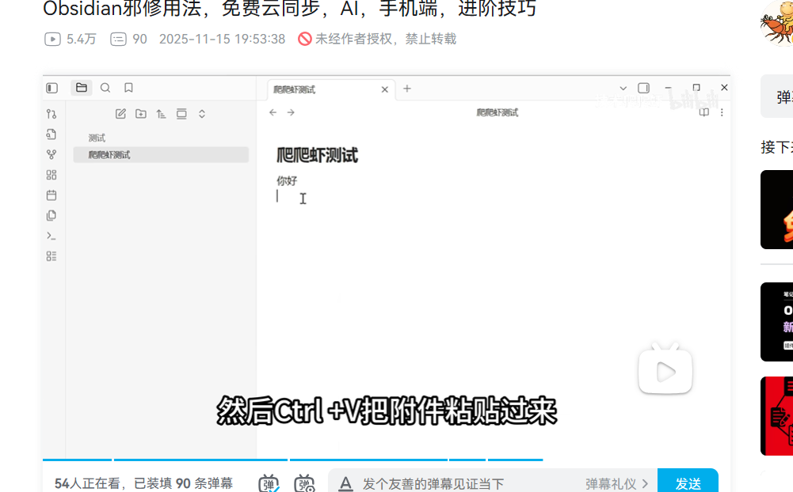

# heading 1
## heading 2
- "-"+"空格" 
- 链接用"[[]]"
- 
# PKMer ： https://pkmer.cn/

# 快捷键
ctrl + o : 切换或创建笔记
ctrl + p : 快速打开命令

**加粗** ： 4个*
~~删除~~ ： 4个~
==高亮== ： 4个=
代码块：`
```python
print("hello word!")

```
>创建引用：>

- 无序列表："-" + "空格"
1. 有序列表："数字" + "." + "空格"
111